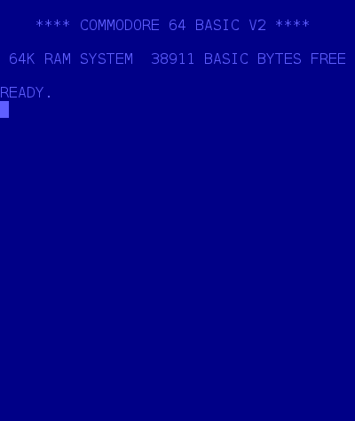

# tmce64
Terminal Mode Commodore 64 Emulator

This is an emulator to run Commodre 64 programs, especially those made in BASIC, in a Linux terminal.

Some features:
* 6510 CPU emulation passes [Dormann tests](https://github.com/Klaus2m5/6502_65C02_functional_tests) and some Lorenz tests.
* Curses based UI with full 256-color support if available.
* Approximate PETSCII to ASCII conversion, for both upper/lower case sets.
* Debugger with CPU trace and breakpoint support.
* CIA timer support, as needed for random numbers in games.
* Run emulation in full speed (warp mode) or closer to original C64 speed.
* Loads PRG programs by injecting them into memory. (No Tape/Disk support!)
* Most BASIC programs should work, machine code programs are hit-and-miss.
* Needs the ROMs from the [VICE emulator](https://vice-emu.sourceforge.io/).

